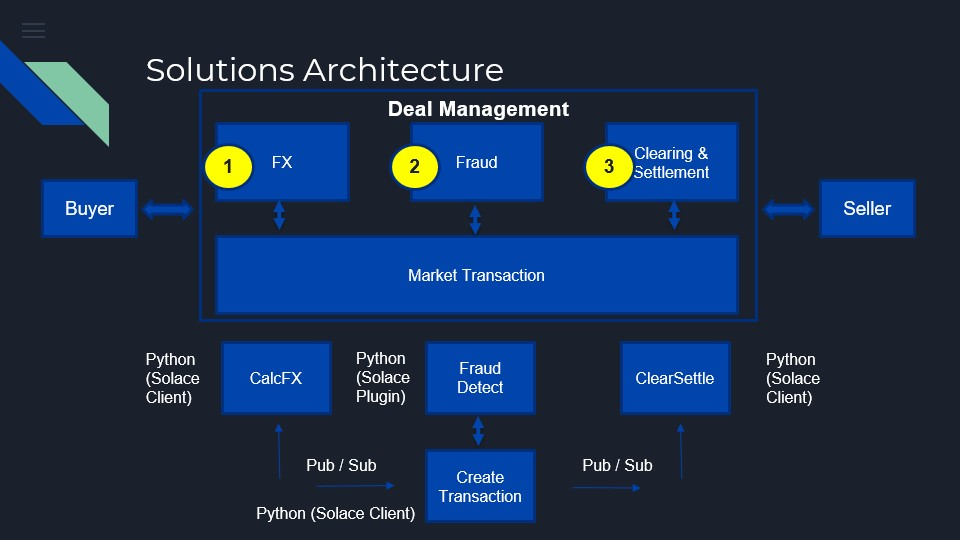
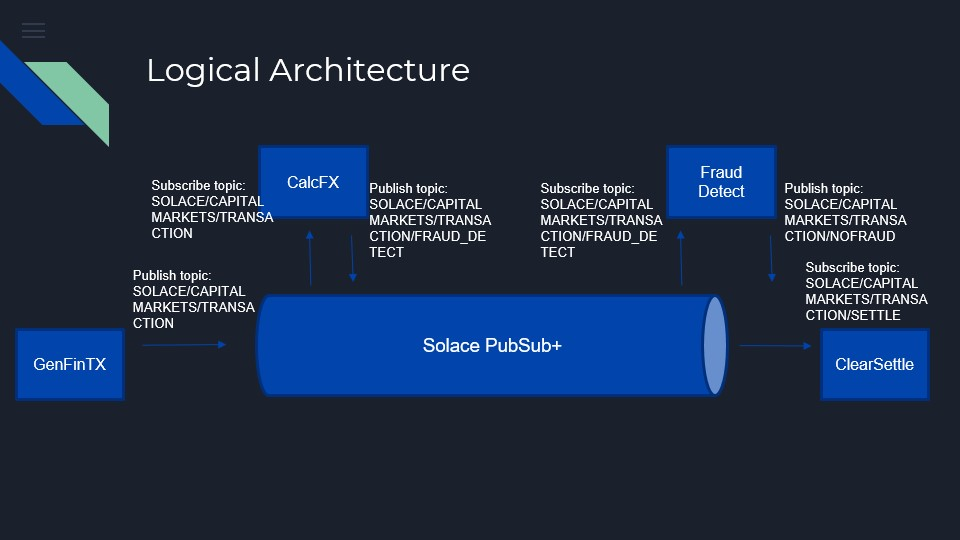

# Solace-CapitalMarkets
The Capital Markets industry has the potential for enumerous digital transformation disruption leveraging EDA (event-driven-architectures) through the ecosystem of business processes, system integrations, and data repositories.  

Messaging frameworks such as Solace contribute to the digital transformation journey enabling agile, adaptable, business processes through EDA, leveraging pub/sub and streaming of messages for processing financial transactions.  The solutions architecture and logical architecture below illustrate usage of Solace's MEP patterns.

For execution of the components, populate the Solace PubSub+ account details within the solace.properties file.

Solutions Architecture

Logical Architecture

